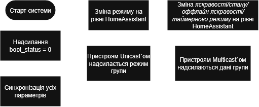

# 🌿 Комп'ютерна система керування фітоосвітленням (ZigBee GreenHouse)

Цей репозиторій містить автономну («законсервовану») версію програмного забезпечення для керування фітоосвітленням на базі мікроконтролерів ESP32 та стеку Zigbee, а також компоненти UI для Home Assistant. 

Головна концепція архітектури полягає в **апаратній незалежності вузлів**. Мікроконтролер локально зберігає у власній пам'яті всі критичні налаштування: таймерні розклади, рівні офлайн-яскравості (NVS), поточний режими роботи та стани каналів. Якщо ж система перезапустилась або не має інформації про стани - вона надсилає boot_status = 0, де на стороні сервера це повідомлення ловиться і починається процес синхронізації пристрою з групою.

  

## Архітектура прошивки

Прошивка написана на C з використанням ESP-ZIGBEE-SDK та розбита на незалежні модулі. Головний вузол ініціалізації Zigbee-мережі знаходиться у файлі `main/esp_zb_switch.c`.

| Компонент | Опис та призначення |
| :--- | :--- |
| **`greenhouse_light_control`** | Відповідає за створення ендпоінтів, їх ініціалізацію. А також за ledstrip. |
| **`modbus`** | Модуль трансляції протоколів. Виконує роль Modbus RTU Master для конвертації бездротових Zigbee-команд у сигнали для драйверів освітлення. |
| **`nvs_storage`** | Відповідає за енергонезалежне збереження стану. Зберігає рівні "офлайн-яскравості" для відновлення після зникнення живлення. |
| **`state_machine`** | Реалізує логіку перемикання режимів роботи (Ручний, Таймер, Автоматичний). Безпосередньо керує драйвером, ledstrip. При отриманні даних від zigbee - перша копія даних йде в zigbee stack, а друга - сюди. Атрибути які потрібно встановлювати вручну також тут реалізовані |
| **`timers`** | Керує апаратними та програмними таймерами. Відповідає за час системи, дає свої дані state_machine якщо зараз таймерний режим. |
| **`reset_configuration`** | Апаратний контроль конфігурації через DIP-перемикачі. Дозволяє фізично задавати номер групи або виконувати Factory Reset при натиску на кнопку 5 секунд. |

---

## Мапа кінцевих точок (Endpoints) та Атрибутів

Контролер реалізує нестандартну топологію Zigbee для підтримки n зон по 3 канали кожна. Логіка така, ендпоінти каналів лежать починаючи з 11, тобто ендпоінт 12 це ендпоінт 2 каналу. Для передачі специфічних налаштувань (таймери, режими) використовуються кастомні кластери.

| Endpoint (EP) | Кластер (Cluster) | Атрибут (Attribute) | Опис функції |
| :--- | :--- | :--- | :--- |
| **EP 1** (System) | - | - | Базові атрибути потрібні для роботи Zigbee stack (назва моделі, опис ...) |
| **EP 2** (MetaData) | `0xFF01` (Custom) | `boot_status` 0x0000 | Статус початкової синхронізації, якщо == 0, тоді відбудеться синхронізація. |
|  |  | `current_mode` 0x0001 | Поточний режим роботи (0 -> manual, 1 -> timer, 2 -> auto, 0xFF -> unknown (використовуться для offline_brightness)) |
|  | `0x000A` (Timer) | `time` 0x0000 | Вбудований в стек кластер часу |
| **EP 11** (Z1, Ch1) | `0x0008` (Level Control) | `current_level` 0x0000 | Поточна яскравість (0-254) першого каналу першої зони. |
|  | `0x0006` (State) | `State` 0x0000 | Стан on\off. |
|   | `0xFC01` (Custom) | `offline_brightness` 0x0000 | Дані оффлайн режиму (0-255), оффлайн яскравість. |
|   |  | `timer_data` 0x0001 | JSON-масив із розкладом таймерів для каналу. |

*(Примітка: Структура Endpoints масштабується EP 11, EP 13  для покриття всіх можливих каналів).*

---

## Програмна екосистема та Інтеграція (JavaScript)

Система використовує кастомні рішення для інтерфейсів, написані на JS (Z2M converter, Z2M extension та HA custom card).

* **`HA_Cards/greenhouse-zone-card.js`**
  Кастомна картка для дашборду Home Assistant. Працює як незалежний MQTT-клієнт через WebSocket. Читає живий кеш стану пристроїв і відправляє команди безпосередньо в топіки MQTT сервера.

* **`external_converters/greenhouse.js`**
  Зовнішній конвертер для Zigbee2MQTT. Забезпечує трансляцію кастомних Zigbee-кластерів та атрибутів (режими роботи, таймерні розклади, налаштування пам'яті) у зручний JSON-формат. Підтримує активне опитування пристроїв при підключенні до мережі. Також на цьому рівні при спробі записати якесь значення в поточний час ESP - конвертер ігнорує вхідне значення і сам вставляє правильний час `Date.now()`

* **`external_extensions/group_extension/greenhouse_grouper.js`**
  Власне розширення (Extension) для ядра Zigbee2MQTT. Відповідає за складну логіку об'єднання мікроконтролерів у групи на рівні координатора. Дозволяє синхронно керувати кількома вузлами через мультикаст-розсилку. Слухає зміну в атрибуті boot_status
---

## Важливі архітектурні рішення

1. **Джерело правди**
   Джерелом правди вважається state.json на рівні Z2M, з відси HA бере інформацію про пристрої 
2. **Ендпоінти**
   Такі ендпоінти як boot_status, current_mode, time розташовуються на ендпоінті метаданих і не є членами групи, їх треба надсилати unicast`ом.
3. **Об'єднання груп на рівні Z2M**
   Групування світильників відбувається на рівні Z2M, а не програмно в Home Assistant, щоб забезпечити Multicast трансляцію.
---
## Виявленні проблеми які не вирішились

1. Якщо пристрій оффлайн і група змінила свій режим -> пристрій буде працювати за старим режимом
2. Не встановлена синхронізація кожні 12 годин
3. Не правильна робота з offline_brightness (або затестити)
4. Не перевірена синхронізація на усіх пристроях хто підключений до HA
5. Не до кінця чистий код, треба відрефакторити.
6. Надсилання boot_status кожні кілька хвилин поки не буде відповіді, якщо ж її немає тоді увійти в режим device reset 

